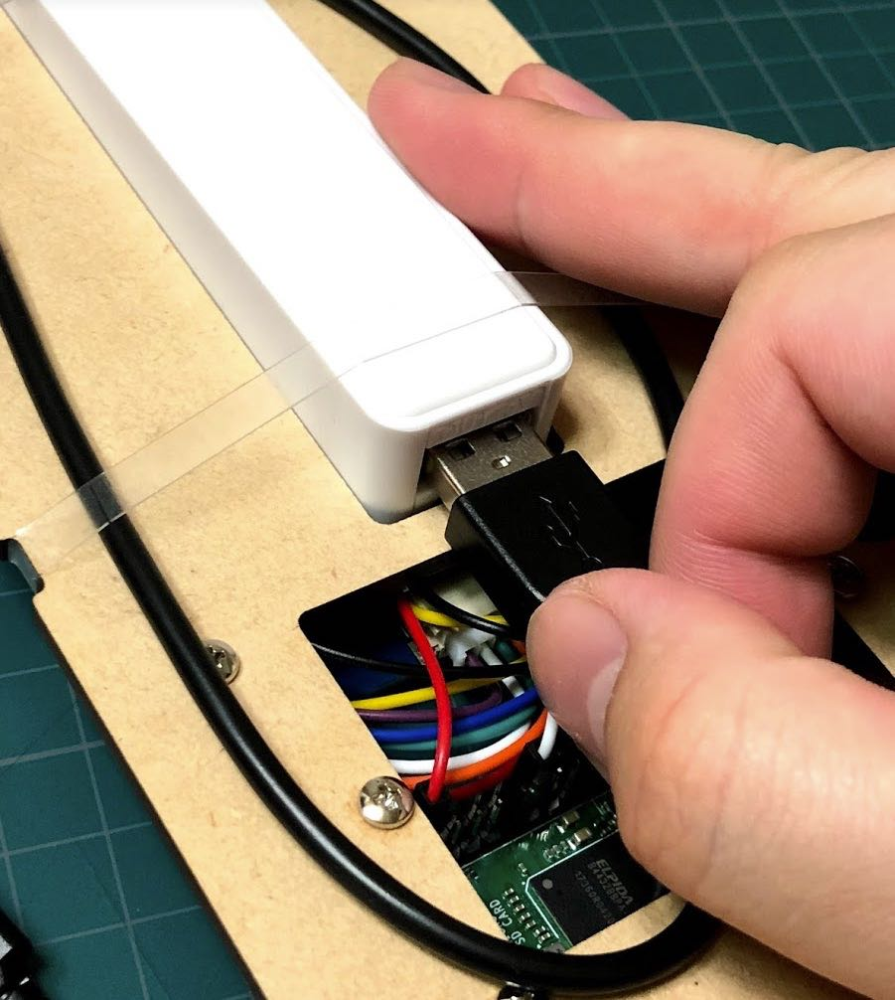
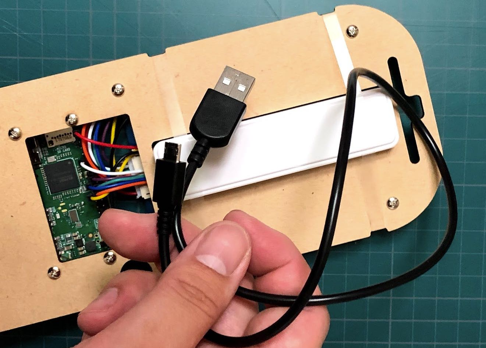
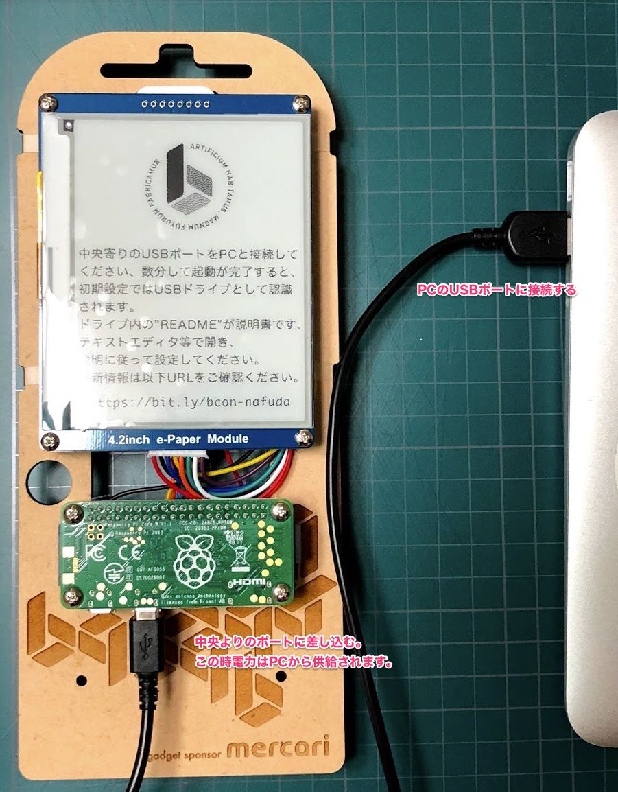
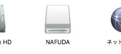
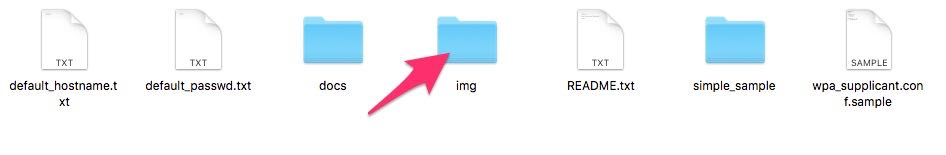
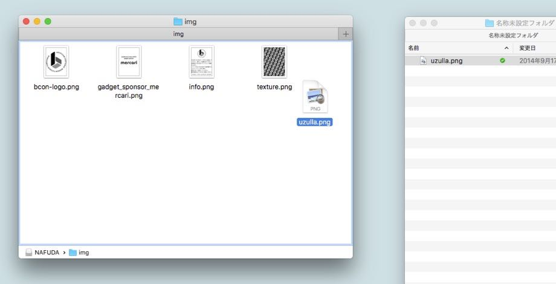
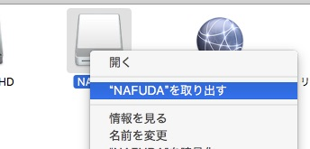

BCON NAFUDA
======

builderscon tokyo 2018で配布される「電子名札」の向けのソフトウェアおよび情報です。

電子名札はraspberry pi zero whをベースに作成されています。

## 電子名札の簡単画像設定

##### 1. 名札にとりつけられたUSBケーブルを取り外します。

##### 2. 取り外したケーブルで、名札とPCをを接続してください。その時にPCへと接続するUSBポートは右側（中央寄り）です。

##### 3. 名札の起動を待ちます。名札が起動完了後、PCにNAFUDAドライブとして認識されます。

##### 4. NAFUDAドライブ中の`img` ディレクトリに好きな画像(拡張子png,jpeg形式)をコピーし、不要な画像を消したり、imgディレクトリから外してください。

##### 5. コピーが終わったら、ドライブを一般的なUSBメモリ同様にイジェクト操作し、少し待ってLEDの点滅がないことを確認してから電子名札とPCのUSBケーブルを抜いてください。

##### 6. 名札とUSBバッテリーをつなぎ、名札を起動してください。

##### 7. imgに保存した画像が、スライドショー表示されます。名札をエンジョイしてください！

> ※ 画像のファイル名は英数小文字で設定ください。

> ※ 画像ファイルは長辺1000px以下で作成ください。

> ※ `img`ディレクトリを含む`NAFUDA`ドライブの中身は初期化される場合があります、かならずPC側に元ファイルを保持してください。

> ※ 想定駆動時間はバッテリー満充電時は約6時間ですが、利用状況や画像の種類などによって大きく変動します。

***

## 以下はドキュメントです。

- [README.md 最初にみてください](docs/README.md)
- [Raspbery Pi へのログイン方法](docs/HOW_TO_LOGIN.md)
- [LICENSE](docs/LICENSE.md)
- [その他ドキュメント](docs/)

## sample application

- [simple_sample - 一番簡単、Hello,World!](simple_sample/README.md)
- [simple nafuda - 名札アプリ(デフォルト導入済み)](simple_nafuda/)
- [show_img - 画像を表示します](show_img/)
- [show_txt - ファイル、あるいは標準入力からのテキストを表示します](show_txt/)
- [weather - 今日のお天気](weather/)

## プルリクお待ちしています！

ドキュメントの誤りや、致命的なバグの修正などがあればお気軽にプルリクください。

また、あなたが新しいアプリケーションを作成したらぜひおしえてください！

## ガジェットスポンサー

実物としての「電子名札」はbuilderscon tokyo 2018 サポーターチケットのノベルティです。

電子名札の実機制作・配布においては [株式会社メルカリ](https://about.mercari.com/) 様にご協賛をいただきました、ありがとうございます！

||
|:---:|
|  |
|謎ガジェットにご理解のあるmercari様|

- [メルカリが、builderscon tokyo 2018の謎ガジェット「電子名札」のスポンサーに！ \#builderscon \- Mercari Engineering Blog](https://tech.mercari.com/entry/2018/08/14/120000)
- [電子名札開発での異常な努力 または私は如何にして心配するのを止めて『謎ガジェット』を作るようになったか \- builderscon::blog](https://blog.builderscon.io/entry/2018/08/09/100000)

