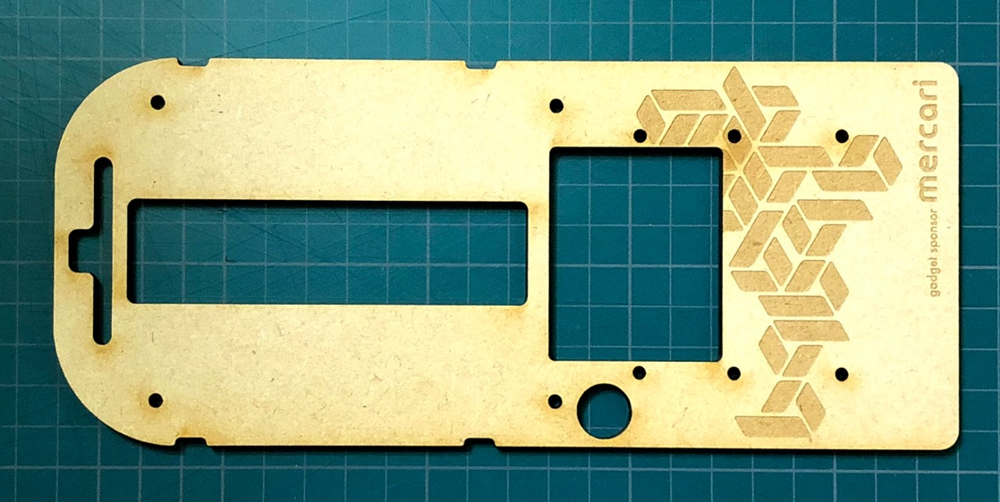
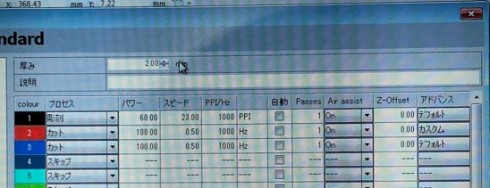

ベースボード
==========

ベースボードをレーザーカッターで加工するためのデータです。

> ※ このデータ(`nafuda_board_v1.ai`)はbuilderscon tokyo 2018での配布物（上記画像）から、「gadget sponsor mercari」を消したものになります。

# 試作環境

- trotec speedy 300 

試作時のパラメーターは以下を参照ください

# ライセンス

CC BY-SA

> buildersconロゴ（b ロゴ）を利用しています。
