g_gadgetをもちいて、Windowsから名札へssh接続する例
========================================

あくまでもこちらの操作は「このようにやればできる事がある」という例で、必ずできるとは限りません。

別の機器のドライバを手動で当てるため、自己責任でお願いいたします。

## 名札を接続する

Windowsに名札を接続し、認識した後に「USB シリアル デバイス」として認識される

> ※ もしそうでなく「USB Ethernet/RNDIS Gadget」として正しく認識されていれば、これらの操作は不要なのでsshの項目までスキップしてください。

## ドライバの取得

http://www.catalog.update.microsoft.com/home.aspx

こちらのページより、RNDIS gadgetで検索。

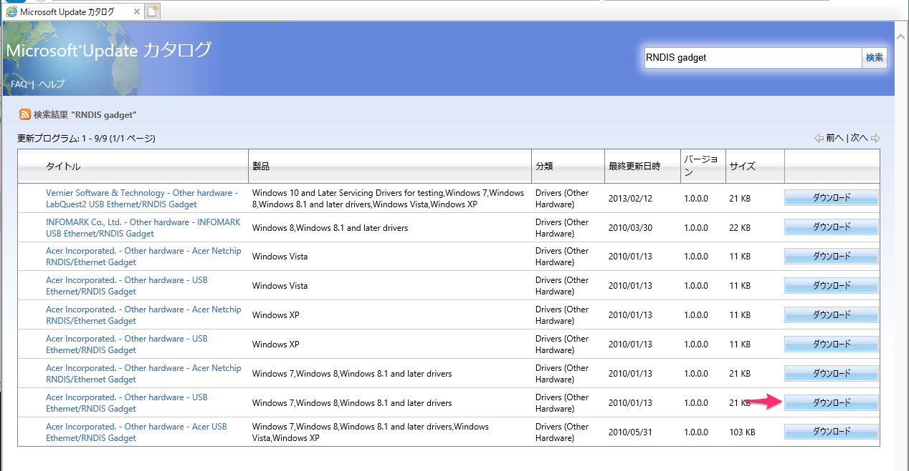

- Acer Incorporated. - Other hardware - USB Ethernet/RNDIS Gadget  Windows 7,Windows 8,Windows 8.1 and later drivers  Drivers (Other Hardware)  
- 2010/01/13
- 1.0.0.0
- 21 KB 

の項目のダウンロードをクリック。

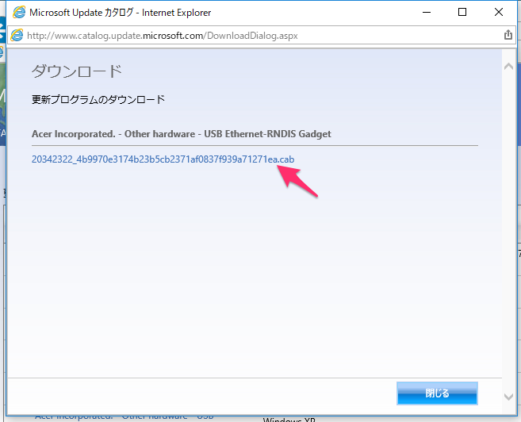
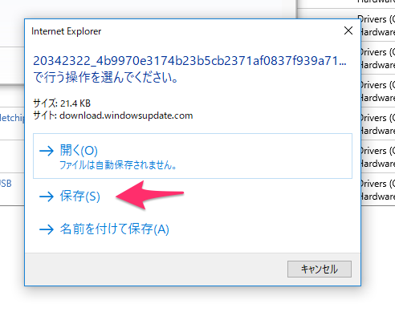

ダウンロードしたcabファイルをひらき、中の２ファイルを適当な所にコピーする（たとえば、デスクトップに新しくフォルダをつくり、その中になど）

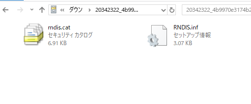

## ドライバのインストール（更新）

デバイスマネージャをひらき、USB シリアルデバイスとして認識された「USB シリアルデバイス」を右クリックし、「ドライバーの更新」をクリック

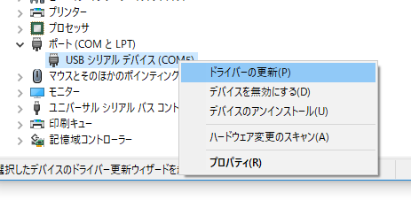

ドライバーの検索方法は「コンピューターを参照して、ドライバーソフトウェアを検索」を選ぶ

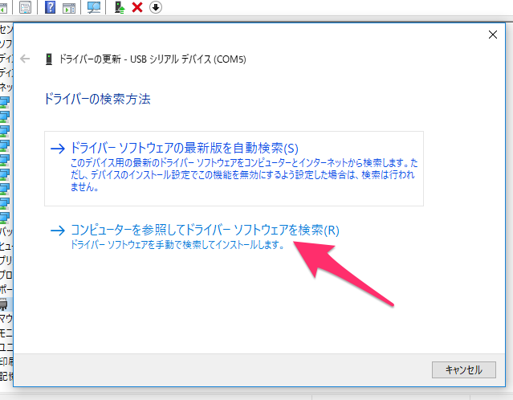

「参照」をおす

先程ファイルをコピーしたディレクトリを選ぶ

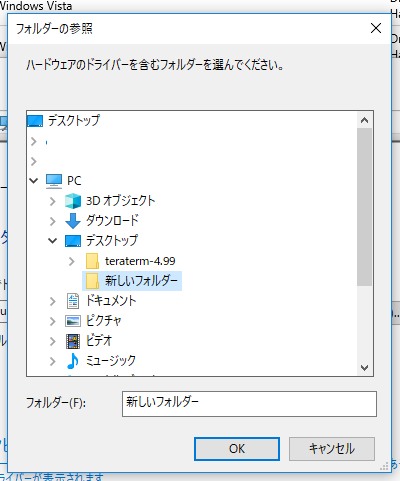

「次へ」をクリック

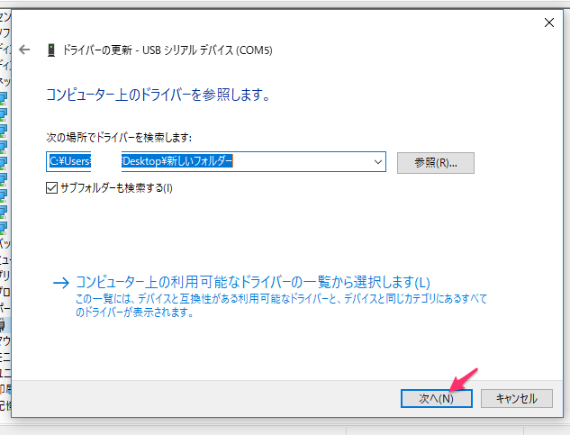

うまく行けば、ここで「USB Ethernet/RNDIS Gadget」として認識する

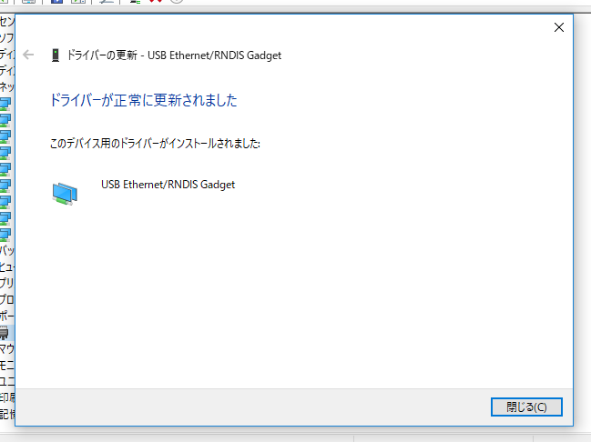
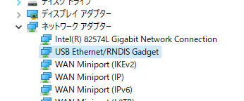

ipconfigにも「イーサネット アダプター イーサネット２」などと現れる（この確認は不要）

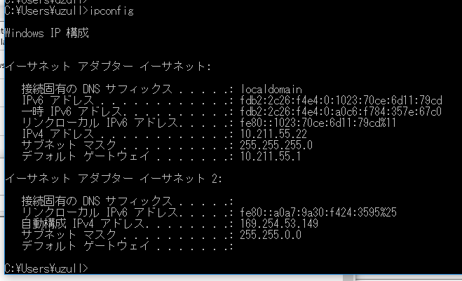

## ssh接続

Tera Termなどで、`169.254.123.45`に接続する

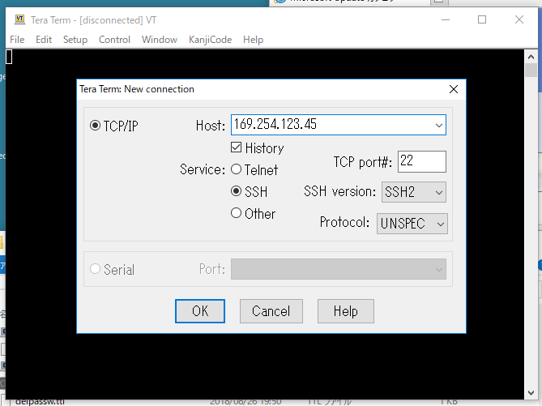

> ※ 特にドライバーインストール直後、Windowsと接続した後つないだ後はIPが変わる事がある。もしこのIPで接続ができなければ、もう一度名札を再起動し、もう一度enable_g_etherをつくり、さらにPCと接続して再起動させ、再度接続を試行する。

> ※ 再起動した直後もつながらないことが多い、１〜３回くらいTera Termで接続を試行しているうちにつながる事が多い。

接続ができると、このような警告が出た後、ID/PASSを入力できるようになる。

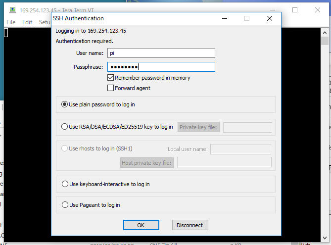
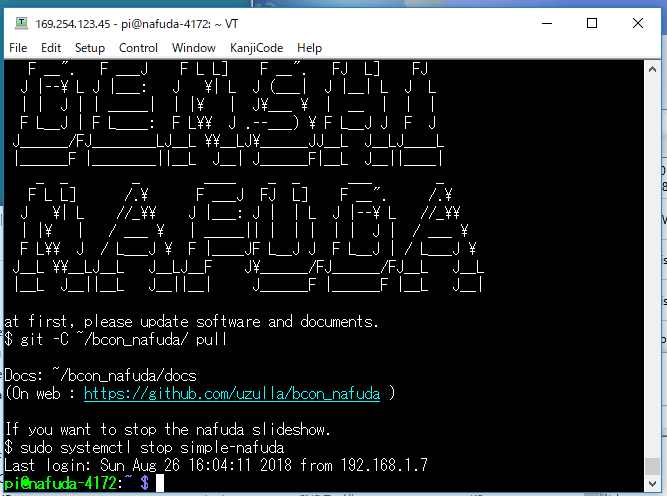

sshでつながれば、同様にsftpやscpなどもつかえるので、WinSCPなどを使い、名札の中にファイル転送などもできる。

