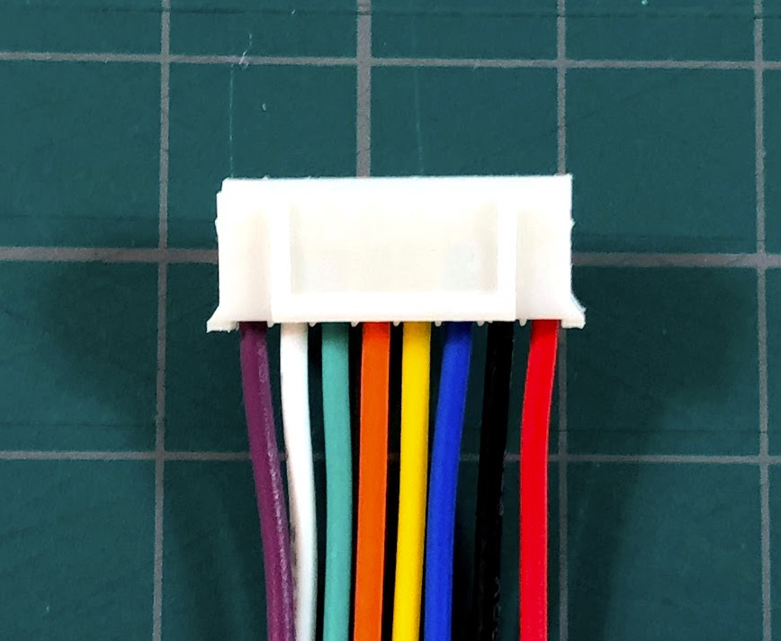
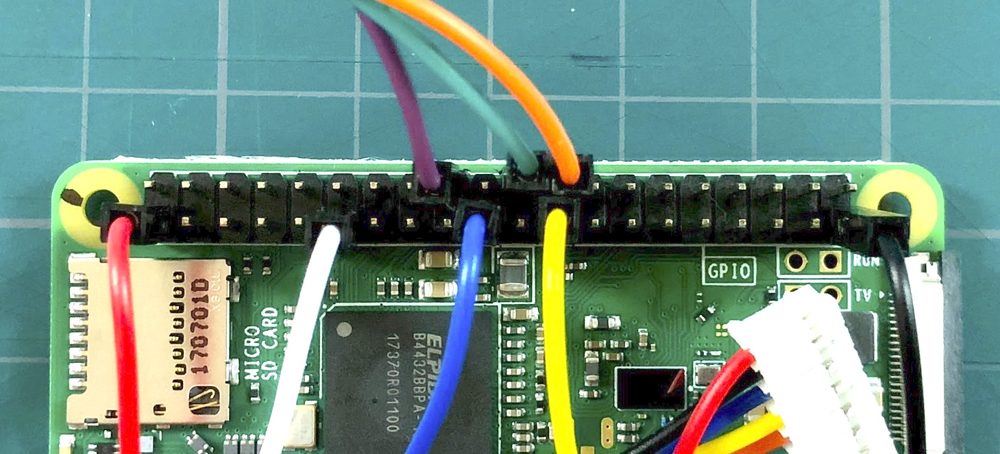

ピンアサイン
==========

ケーブルが抜けた際には、こちらの情報を元にしてさしなおしてください。

## E-paper コネクタ側

> こちらはコネクタのリブ（突起）の見える面です

|1|2|3|4|5|6|7|8|
|---|---|---|---|---|---|---|---|
|紫|白|緑|橙|黄|青|黒|赤|
|BUSY|RST|DC|CS|CLK|DIN|GND|3.3V|

この配置は、リブのある面を上から見たものです。

e-paper ディスプレイを画面の裏を見たとき、リブのある面が見えるように接続してください。

## Raspberry pi ピンアサイン

> ピン周りが見やすいように、板から取り外して撮影しています。

| | | | |  |  |  |  |  |  |  |  |  |  |  |  |  |  |  |  |
|---|---|---|---|---|---|---|---|---|---|---|---|---|---|---|---|---|---|---|---|
|  |  |  |  |  |  |  |  |紫|  |緑|橙|  |  |  |  |  |  |  |  |
| 2| 4| 6| 8|10|12|14|16|18|20|22|24|26|28|30|32|34|36|38|40|
| 1| 3| 5| 7| 9|11|13|15|17|19|21|23|25|27|29|31|33|35|37|39|
|赤|  |  |  |  |白|  |  |  |青|  | 黃|  |  |  |  |  |  |  |黒|

この配置は、ピンを差し込む面（チップなどが見える面）をみながら、microSDスロットを左にして見たものです。

> ※ Raspberry piのGPIOピンの意味は、`raspberry pi zero wh gpio`で検索したり、公式サイトなどを参照ください。

> ※ 「遠く離れた」1番から3.3V、39番からGNDをとっているのは、ただわかりやすさの都合です。