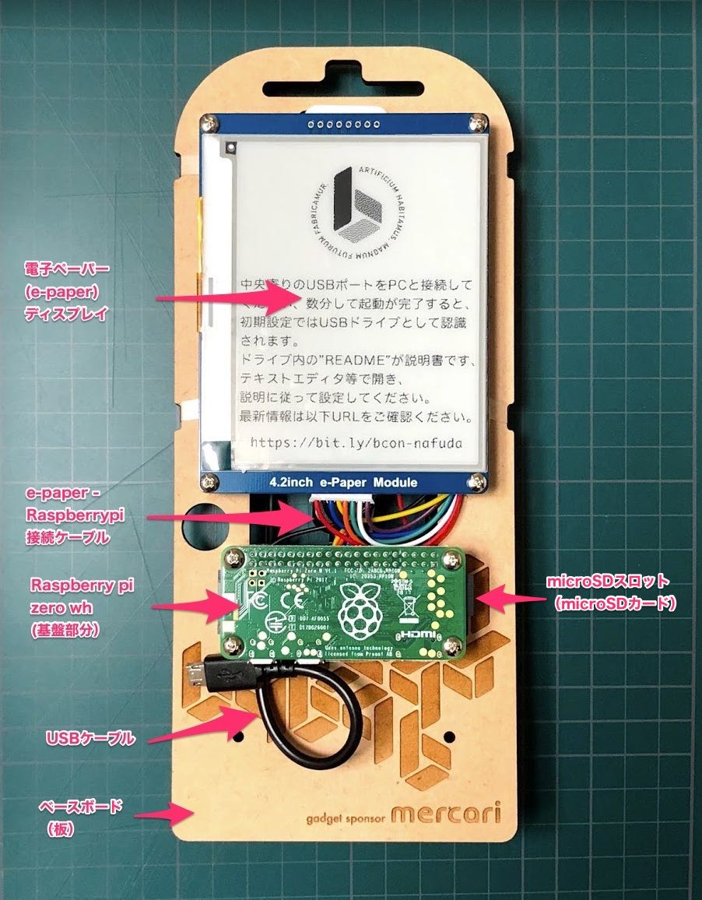
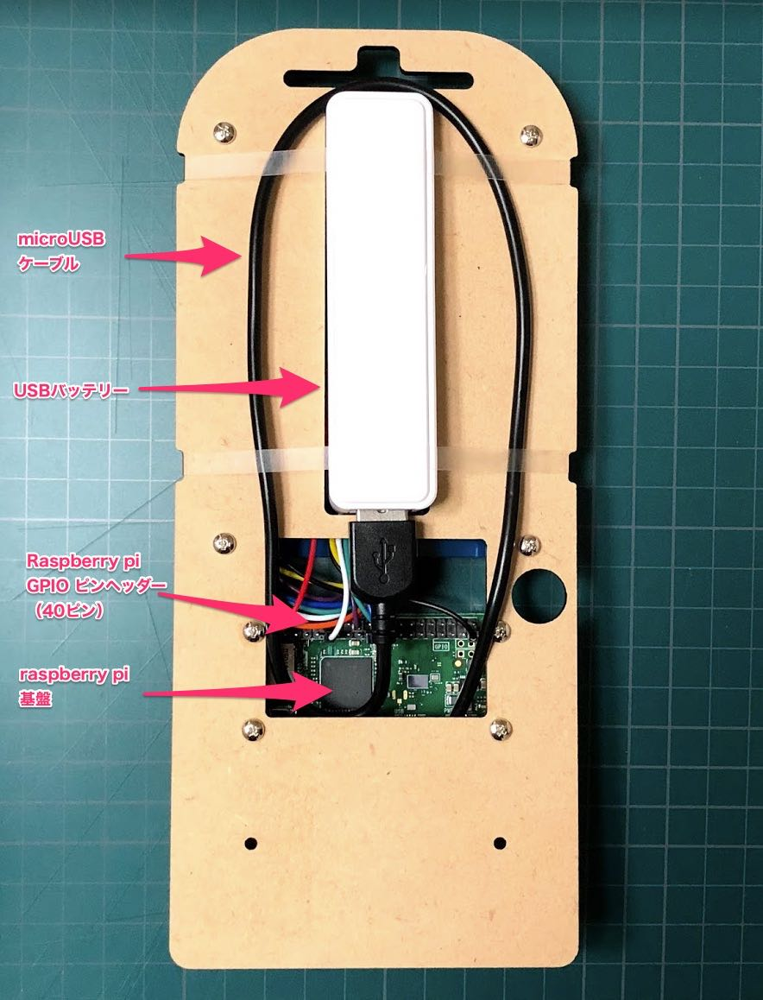
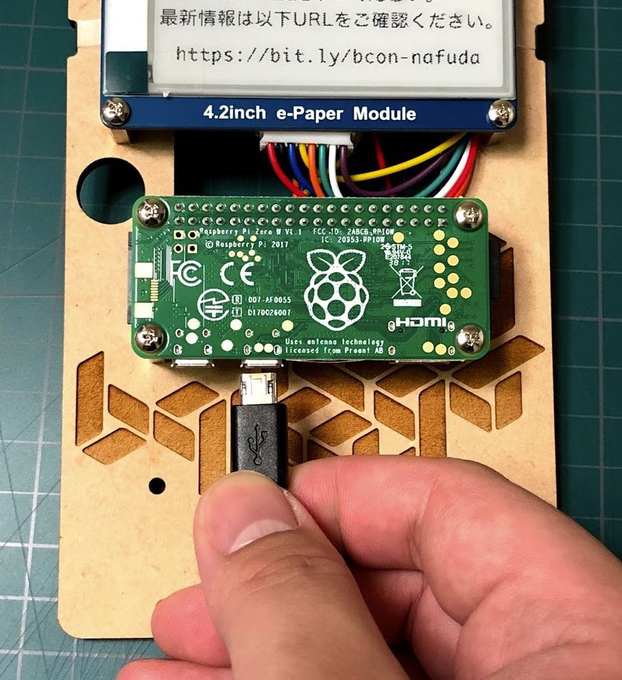

# NAFUDA

電子名札の取扱説明書です。

## このドキュメントは最新版ではないかもしれません

最新版のドキュメントは以下のURLにアクセスしてご確認ください。

> ※ あなたが今GitHubのmaterブランチをみているなら最新版です。

https://github.com/uzulla/bcon_nafuda

## 最初にご注意いただきたいこと

- 添付のモバイルバッテリーは絶対に充電しながらラズパイへ給電しないでください。
- 電子名札は精密機械です。濡らしたり、落としたり、力をかけたりしないでください。
- 尖った部分があり、静電気は大敵です。取扱には注意してください。（あるいはケースを自作しましょう）
- microSDや各種ケーブルは接着固定等はされていません、抜けないように注意して取扱ください。（あるいはテープなどで止めましょう）

## 同梱物内容

- ベースボード（木の板）
- Raspberry pi zero wh（取り付け済み）
- e-Paper ディスプレイ（取り付け済み）
- e-Paper <-> Raspberry pi 接続ケーブル（取り付け済み）
- microSD 8GB（取り付け済み）
- microSD、SD変換アダプタ（同梱）
- USB充電専用ケーブル（白、同梱）
- USB通信ケーブル（白あるいは黒、同梱）

※ 名札として利用するために首からさげるストラップは、受付時に配布される通常のストラップをご利用いただくか、あるいは適当な紐をご用意ください。

## 各部解説

## サポートにつきまして

ビルダーズコン運営により、初期不良のみ対応をさせていただきます。
（木の板以外は汎用部品ですので、補修パーツを購入し、ご自身での修理が可能です）

builderscon tokyo 2018当日に動作するかを確認し、問題があれば受付スタッフにお声がけください。

ハック方法などのアドバンスドなご相談は、制作者が個人的に対応致します。

## 電源のオンオフ

基盤部分にUSBケーブルを挿すと電源オン、抜くとオフです。初期状態での初回起動には約1〜2分かかります。(4~5分たっても起動しない、LEDの点滅が１分近くおこらない場合、なにかがおかしいと思われます)

基盤部分（Raspberry pi zero wh部分）には2つのmicro USBコネクタがあり、左側（外に近い側）が電源供給専用、右側（中央寄り側）がPC等との通信兼用ポートです。どちらにUSB電源を接続しても電源がオンとなります。

電源がはいると緑色のLEDが点灯します。LEDは（デフォルトでは）microSDアクセス時に点滅します。つかない場合は、USBバッテリーが放電していないか、microSDが抜けていないかをご確認ください。

電源投入後、しばらく（〜数分）まつとプログラムが起動し、電子ペーパーに画像などが表示されます。初期状態ではロゴが繰り返し表示されます。もし起動しない場合にはmicroSDの初期化が必要です。（詳しくは`FOR_HACKER.md`を参照ください）

電源を切るには、LEDが点滅していないことを確認した上でUSB電源を抜きます。

※ 適切な手段をせず（たとえばshutdown -h nowせず）いきなり電源を抜くのは（製作者も）どうかと思いますが、コストの都合です。ぜひご自身でシャットダウンスイッチを実装などしてみてください！

## 電子名札の簡単画像設定

1. USBメモリドライブ（USB Mass Storage Class）を認識できるPC等に電子名札を接続してください。その時にPCへと接続するUSBポートは右側（中央寄り）です。
2. 名札の起動を待ちます（名札が起動完了後、認識されます）
3. PCに`NAFUDA`という名称のドライブが現れますので、その中の`img` ディレクトリに好きな画像(png,jpeg形式)をコピーしてください。
4. コピーが終わったら、ドライブを一般的なUSBメモリ同様にイジェクト操作し、少し待ってLEDの点滅がないことを確認してから電子名札とPCのUSBケーブルを抜いてください。
5. USBバッテリーなどの電源をつなぎ、名札を起動してください。（電子名札として動作させる際には、左側（外側）のUSBポートにつなぐことをおすすめします。
6. imgに保存した画像が、スライドショー表示されます。名札をエンジョイしてください！

> ※ 画像のファイル名は英数小文字で設定ください。

> ※ 画像ファイルは長辺1000px以下を設定ください。

> ※ `img`ディレクトリを含む`NAFUDA`ドライブの中身は初期化される場合があります、かならずPC側に元ファイルを保持してください。

> ※ 想定駆動時間はバッテリー満充電時は約6時間ですが、利用状況や画像の種類などによって大きく変動します。

### 仕様など

- 名札の電子ペーパー解像度は 300x400 pxです（縦の場合）。
- 電子ペーパーはモノクロ（２値）です。
- 初期に動作している`simple-nafuda` サンプルプログラムは、画像がディスプレイサイズを超過する場合は自動的に縮小し、サイズが不足する場合は中央寄せします。カラーやグレイスケール画像はディザリングで２値に変換します。
- スライドショーのインターバル速度は設定変更できません。
  - （というより、シリアルデータ転送に時間がかかるのでこれが最速です。より高速な描画をする場合にはC言語を用いたサンプルプログラムを検討してください！詳しくは`FOR_HACKER.md`を参照ください。）

## 電子名札をハックせんとするハッカーの皆さんへ

名札をハックしたい！という方は、[`HOW_TO_LOGIN.md`](HOW_TO_LOGIN.md)や[`FOR_HACKER.md`](FOR_HACKER.md)を確認ください。ログイン方法などを記載しています。

それでは楽しい電子名札、謎ガジェットライフを！
